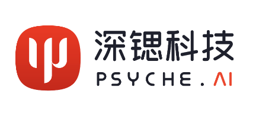

# EmoTalk: Speech-Driven Emotional Disentanglement for 3D Face Animation [ICCV2023]

Official PyTorch implementation for the paper:

> **EmoTalk: Speech-Driven Emotional Disentanglement for 3D Face Animation**, ***ICCV 2023***.
>
> Ziqiao Peng, Haoyu Wu, Zhenbo Song, Hao Xu, Xiangyu Zhu, Jun He, Hongyan Liu, Zhaoxin Fan
>
>  [Arxiv](https://arxiv.org/abs/2303.11089) | [Project Page](https://ziqiaopeng.github.io/emotalk/) | [License](https://github.com/psyai-net/EmoTalk_release/blob/main/LICENSE)


<p align="center">

</p>

> Given audio input expressing different emotions, EmoTalk produces realistic 3D facial animation sequences with corresponding emotional expressions as outputs.
## News
- `2023.10.17` Thanks to [noirmist](https://github.com/noirmist)! Now you can create the environment via docker.
## Environment

- Linux
- Python 3.8.8
- Pytorch 1.12.1
- CUDA 11.3
- Blender 3.4.1
- ffmpeg 4.4.1

Clone the repo:
  ```bash
  git clone https://github.com/psyai-net/EmoTalk_release.git
  cd EmoTalk_release
  ```  
Create conda environment:
```bash
conda create -n emotalk python=3.8.8
conda activate emotalk
pip install torch==1.12.1+cu113 torchvision==0.13.1+cu113 torchaudio==0.12.1 --extra-index-url https://download.pytorch.org/whl/cu113
pip install -r requirements.txt
```


## **Demo**
Download Blender and put it in this directory.
```bash
wget https://ftp.nluug.nl/pub/graphics/blender/release/Blender3.4/blender-3.4.1-linux-x64.tar.xz
tar -xf blender-3.4.1-linux-x64.tar.xz
mv blender-3.4.1-linux-x64 blender && rm blender-3.4.1-linux-x64.tar.xz
```
Download the pretrained models from [EmoTalk.pth](https://drive.google.com/file/d/1KQZ-WGI9VDFLqgNXvJQosKVCbjTaCPqK/view?usp=drive_link) (Updated). Put the pretrained models under `pretrain_model` folder. 
Put the audio under `aduio` folder and run
```bash
python demo.py --wav_path "./audio/disgust.wav"
```
The generated animation will be saved in `result` folder.


## **Dataset**
If someone wants to download the 3D-ETF dataset, please fill in the [agreement](https://drive.google.com/file/d/1AQ5_focSgw9WiJdA2R44BQOrdTUe2ABd/view?usp=drive_link), and use the education mailbox to email Ziqiao Peng (pengziqiao@ruc.edu.cn) and cc Zhaoxin Fan (fanzhaoxin@psyai.net) to request the download link.

## **Citation**
If you find this work useful for your research, please cite our paper:
```
@InProceedings{Peng_2023_ICCV,
    author    = {Peng, Ziqiao and Wu, Haoyu and Song, Zhenbo and Xu, Hao and Zhu, Xiangyu and He, Jun and Liu, Hongyan and Fan, Zhaoxin},
    title     = {EmoTalk: Speech-Driven Emotional Disentanglement for 3D Face Animation},
    booktitle = {Proceedings of the IEEE/CVF International Conference on Computer Vision (ICCV)},
    month     = {October},
    year      = {2023},
    pages     = {20687-20697}
}
```

## **Acknowledgement**
Here are some great resources we benefit:
- [Faceformer](https://github.com/EvelynFan/FaceFormer) for training pipeline
- [EVP](https://github.com/jixinya/EVP) for training dataloader
- [Speech-driven-expressions](https://github.com/YoungSeng/Speech-driven-expressions) for rendering
- [Wav2Vec2 Content](https://huggingface.co/jonatasgrosman/wav2vec2-large-xlsr-53-english) and [Wav2Vec2 Emotion](https://huggingface.co/r-f/wav2vec-english-speech-emotion-recognition) for audio encoder
- [Head Template](http://filmicworlds.com/blog/solving-face-scans-for-arkit/) for visualization.

Thanks to John Hable for sharing his head template under the CC0 license, which is very helpful for us to visualize the results.

## **Contact**
For research purpose, such as comparison of experimental results, please contact pengziqiao@ruc.edu.cn

For commercial licensing, please contact fanzhaoxin@psyai.net

## **License**
This project is licensed under the Creative Commons Attribution-NonCommercial 4.0 International License. Please read the [LICENSE](LICENSE) file for more information.

## **Invitation**

We invite you to join [Psyche AI Inc](https://www.psyai.com/home) to conduct cutting-edge research and business implementation together. At Psyche AI Inc, we are committed to pushing the boundaries of what's possible in the fields of artificial intelligence and computer vision, especially their applications in avatars. As a member of our team, you will have the opportunity to collaborate with talented individuals, innovate new ideas, and contribute to projects that have a real-world impact.

If you are passionate about working on the forefront of technology and making a difference, we would love to hear from you. Please visit our website at [Psyche AI Inc](https://www.psyai.com/home) to learn more about us and to apply for open positions. You can also contact us by fanzhaoxin@psyai.net.

Let's shape the future together!!


